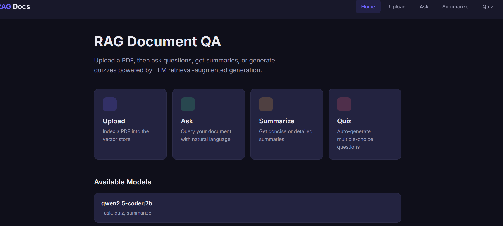
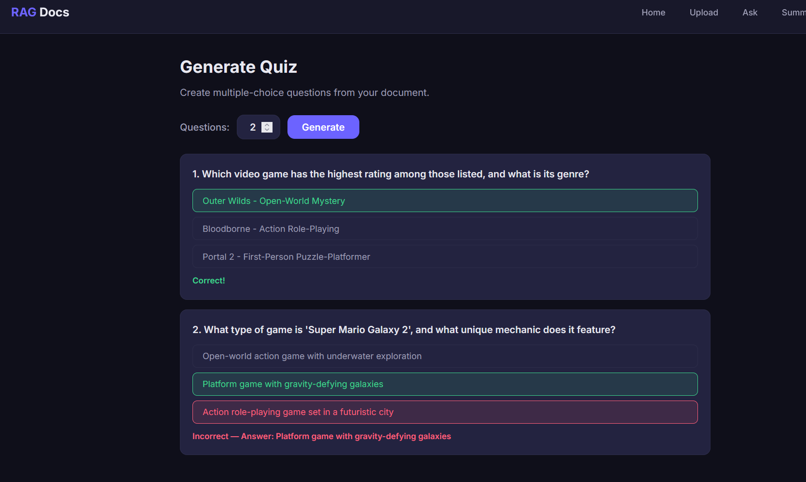
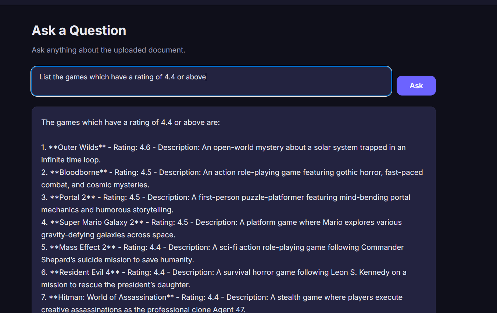
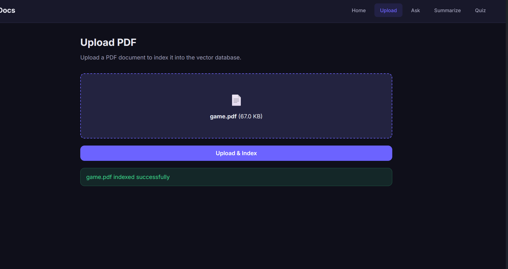
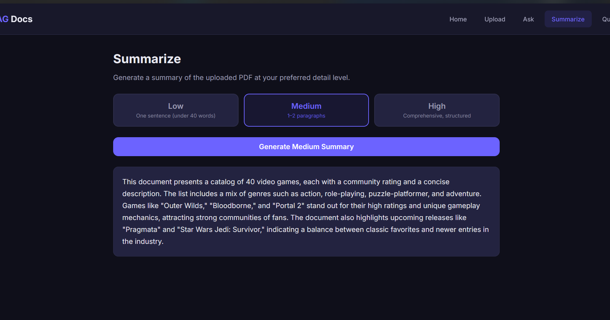

# 📚 PDF Intelligent Q&A System

An intelligent document processing system that allows you to upload PDFs and ask natural language questions about their content using local AI models. Built with FastAPI, LangChain, and Ollama for complete privacy and offline operation.

## ✨ Features

- 📄 **PDF Upload & Processing** - Upload any PDF document for instant indexing
- 🤖 **Local AI Integration** - Uses Ollama to run Qwen 2.5 Coder 7B locally (no API keys needed!)
- 💬 **Natural Language Q&A** - Ask questions in plain English and get accurate answers
- 📊 **Smart Document Retrieval** - RAG (Retrieval-Augmented Generation) with MMR for relevant context
- 📝 **Auto-Generated Quizzes** - Create multiple-choice questions from any document
- 📖 **Document Summarization** - Generate summaries at low, medium, or high detail levels
- 🔒 **100% Private** - All processing happens on your machine

## 🖼️ Project Screenshots

### Upload Interface


*Upload your PDF documents for processing*

### Ask Questions


*Ask natural language questions about your document*

### Quiz Generation


*Automatically generate quizzes from document content*

### Summarization


*Get summaries at different detail levels*

### Model Selection


*Choose from multiple local AI models*

### System Architecture


*Complete system architecture diagram*

## 🏗️ Architecture


## 🚀 Quick Start

### Prerequisites

- Python 3.11+
- [Ollama](https://ollama.com/) installed
- 8GB+ RAM (16GB recommended)
- NVIDIA GPU (optional, for faster inference)

### Installation

1. **Clone the repository**
```bash
git clone <your-repo-url>
cd langchain/backend